# Using DCGAN to generate fake cryptopunk
You can use this project to generate your own cryptopunk without money 😂
Just for fun :-D

## File structure
```
.
├── imgs
│   ├── 1.png
│   ├── 2.png
│   └── ...png
├── params
│   ├── Discriminator.pth
│   └── Generator.pth
├── results
│   ├── 1.png
│   ├── 2.png
│   └── ...png
├── data.py
├── net.py
├── results.py
├── train.py
├── utils.py
└── README.md
```

## Quick up
What you need to change is just the path in train.py and results.py

## Results(You can  check the dir 'results')
Now:😂
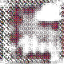
<!--
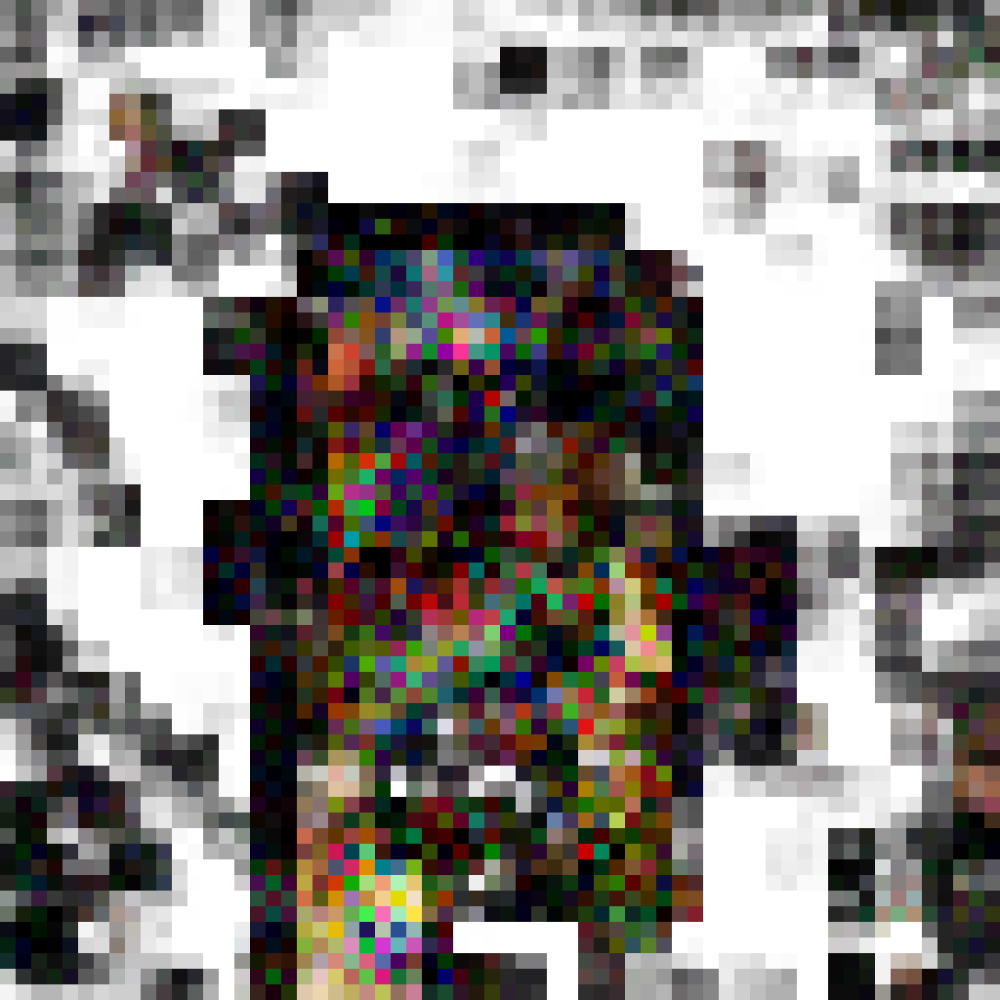
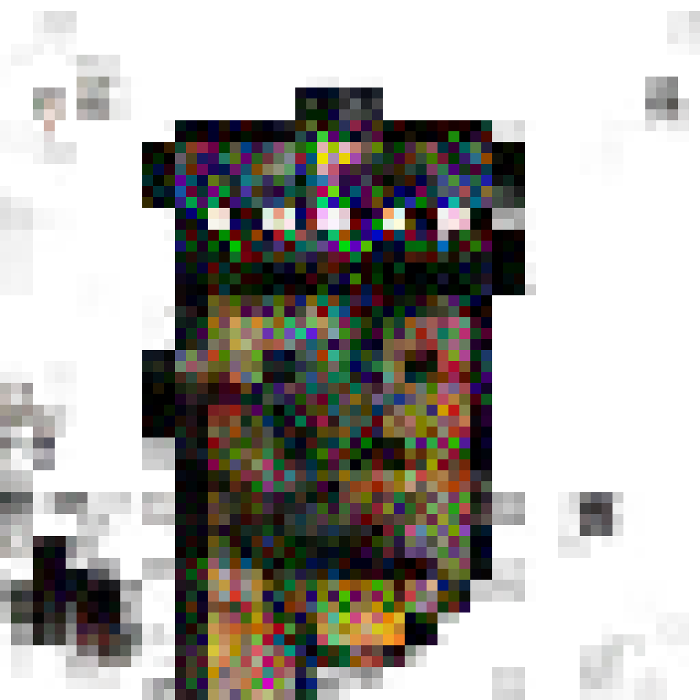
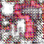
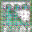
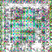
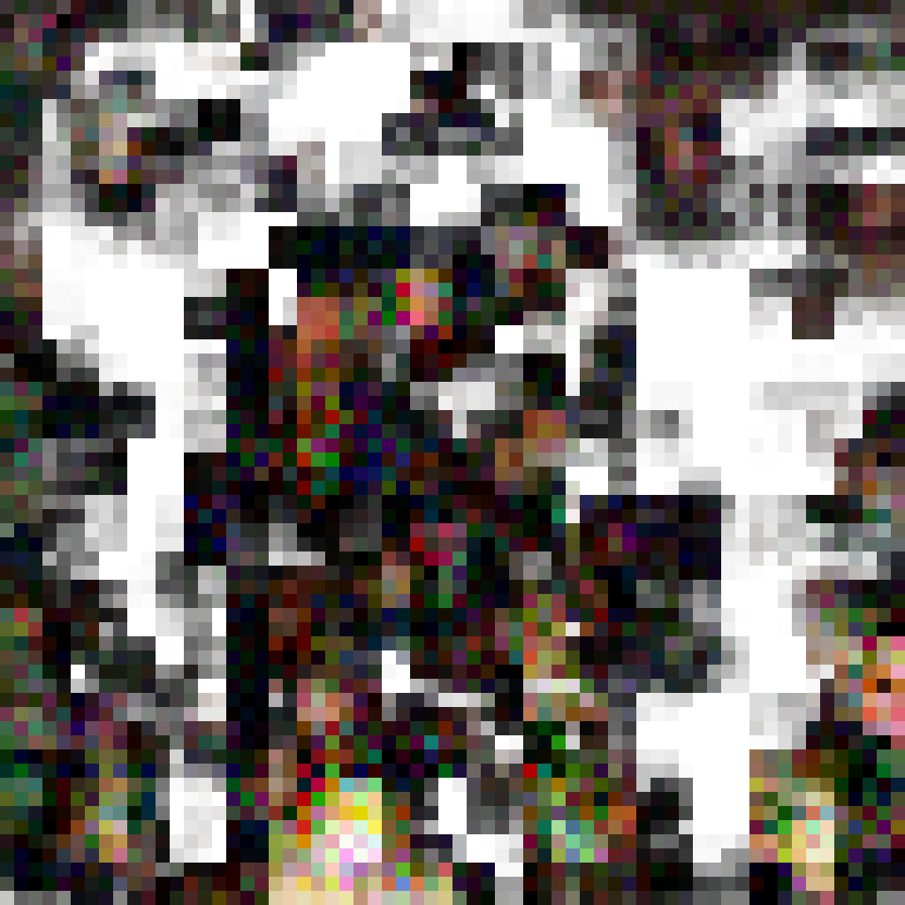
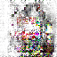
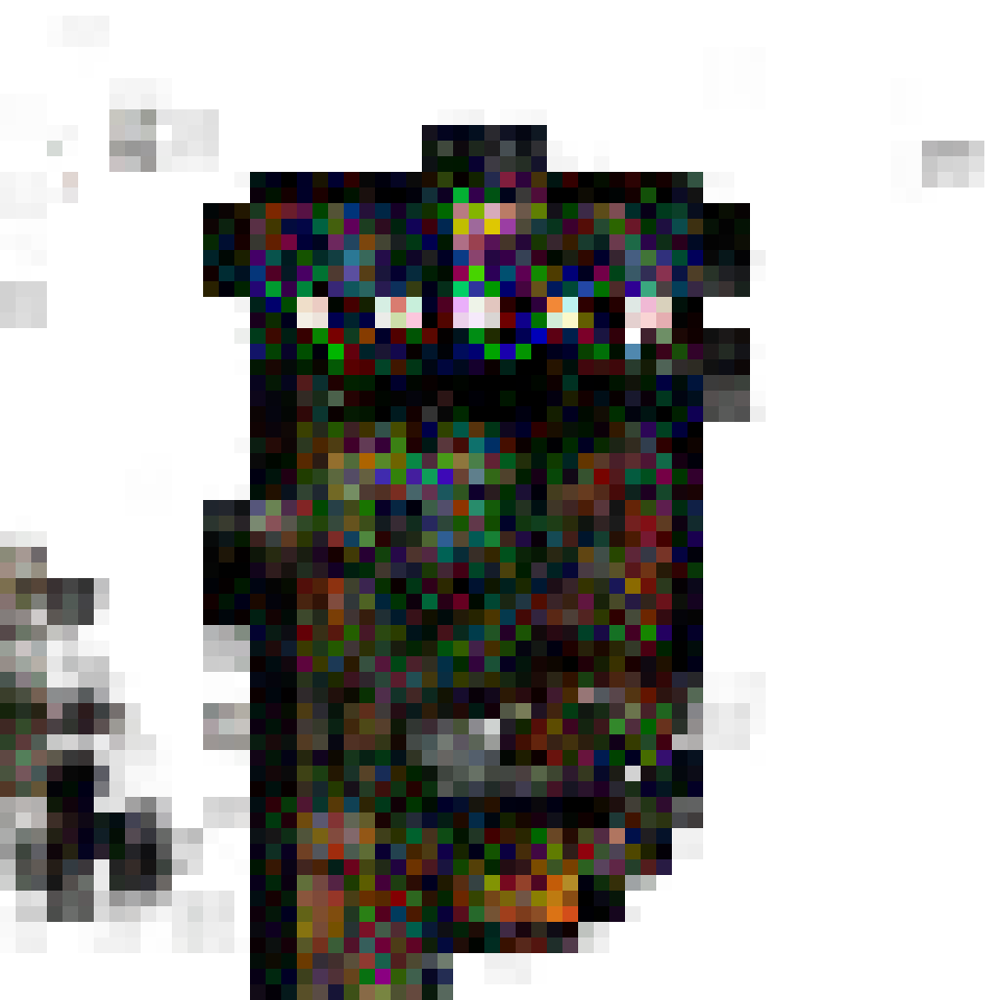
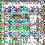
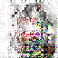
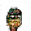
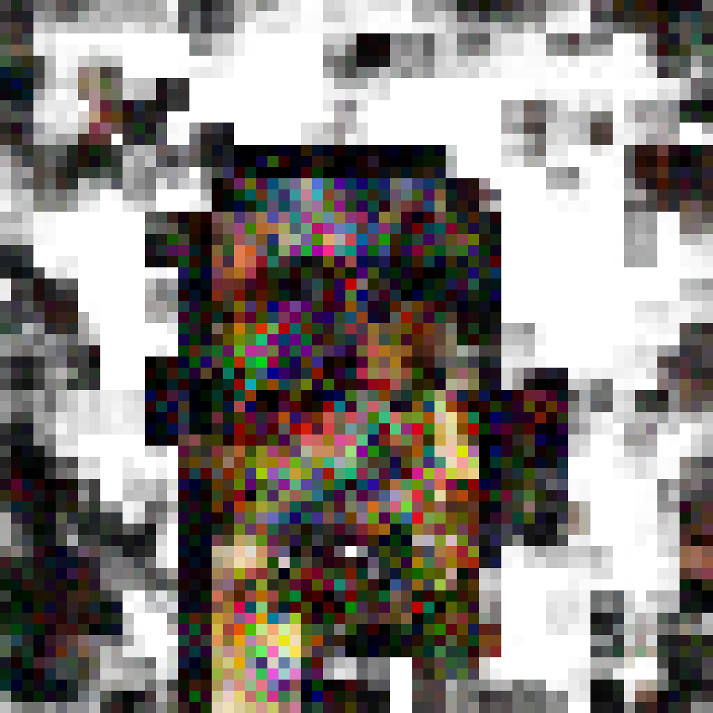
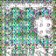
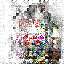
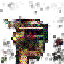
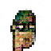
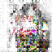
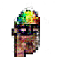
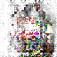

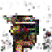
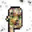
-->